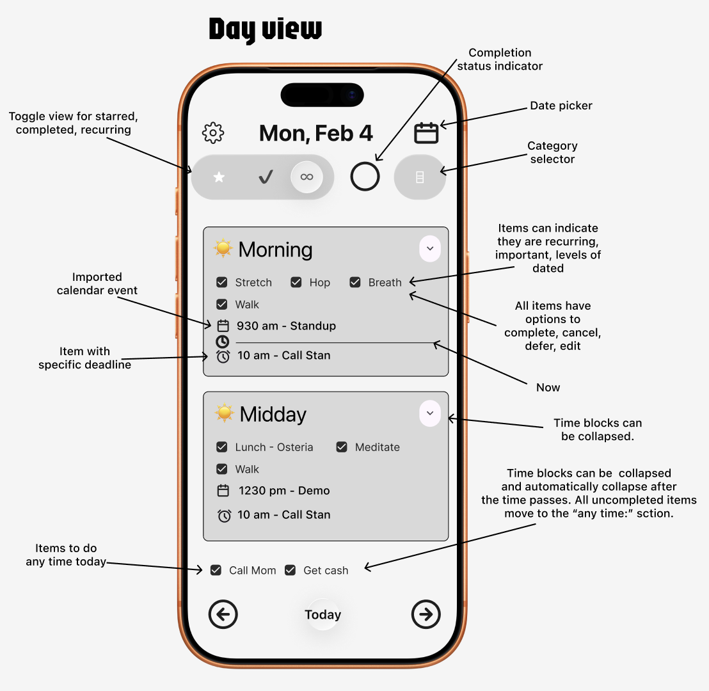

# Daily Flight Plan

A daily planning and execution app for iOS, inspired by an airplane flight plan checklist. Today is your trip; this is your checklist.

I took an app idea in my mind, sketched it out in Figma, broke that into a detailed requirements spec, and fed that to a Claude agent to make an architecture and a plan.

- [`docs/project-spec-prompt.md`](DailyFlightPlan/docs/project-spec-prompt.md) — original feature and UX specs
- [`docs/implementation-plan.md`](DailyFlightPlan/docs/implementation-plan.md) — phased build plan and progress
- [`docs/architecture.md`](DailyFlightPlan/docs/architecture.md) — folder structure, data models, services, UI direction

## The original idea



## Concept

Combines one-off and recurring tasks, organized into time-of-day sections (Morning, Midday, Afternoon, Evening, Night). Items with specific deadlines appear as timed rows; items assigned to a section appear in a horizontal flow; items with no time at all land in an "Any Time" area at the bottom. A "now" bar tracks your current position in the day. Calendar events and Reminders from the system appear inline alongside your own tasks. Sections whose time has passed are removed from view; their content is reorganized into "Past" (calendar events), "Missed" (deadline items and timed reminders), and "Any Time" (untimed items). Navigate to a future date to see a ghosted preview of your expected recurring habits.

## Tech stack

- **SwiftUI + Liquid Glass** — primary UI framework with iOS 26 glass effects
- **SwiftData** — local persistence (iCloud sync planned)
- **EventKit** — Calendar and Reminders integration
- **SwiftUI-Flow** (`HFlow`) — horizontal wrapping flow layouts for item pills
- **`@Observable @MainActor` ViewModels** — no Combine
- **Protocol-based services** injected via `@Environment` + `@Entry`

## Features (current)

- Day view with collapsible time-of-day sections
- Navigate between days with a directional slide animation
- "Go to today" button (appears only when you've navigated away)
- Add and edit items via a full-featured form (title, notes, flag, deadline, section, recurring days, categories)
- Swipe to cancel or defer an item to tomorrow; long-press for a context menu
- Recurring items with weekday picker
- Deadline-based items with clock-time rows
- Scroll-to-now on appear
- Progress ring showing completed/total items for the day
- Filter bar: flagged, done, recurring, and category filters
- Category management (add, rename, delete)
- Theme switcher (Cupertino, 8-Bit, Kerby, Flamingo)
- Calendar events from EventKit shown inline in each day section
- Reminders from EventKit shown inline, with list color indicator; live-updates on store changes
- **Spillover**: pending items from previous days automatically move to today on launch or at midnight
- **Live day structure**: past sections disappear in real time as their time window ends; their content redistributes into "Past" (calendar events), "Missed" (deadline items + timed reminders), and "Any Time" (untimed/section-missed items)
- **Future date preview**: recurring habits for a future weekday appear ghosted in their section — not yet committed, just a projection

## Project structure

```
DailyFlightPlan/
├── Common/              — App entry point, Environment.swift, service injection
├── Persistence/         — SwiftData models (PlanItem, PlanCategory, DaySection, ItemStatus)
├── Preferences/         — AppStorageKeys enum
├── Services/
│   ├── Calendar/        — CalendarService protocol + EventKit + mock
│   ├── Reminders/       — RemindersService protocol + EventKit + mock
│   └── Categories/      — CategorySelectionService
├── Theming/             — DFPTheme enum, ThemeViewModifier
└── Views/
    ├── Components/      — DaySectionView, ItemPillView, DeadlineItemRow, CalendarEventRow,
    │                      ReminderItemRow, NowBarView, ProgressRingView, CategoryCapsule
    ├── View Models/     — DayViewModel, ItemFormViewModel, CategoriesEditViewModel
    ├── DayView.swift
    ├── ItemForm.swift
    └── CategoriesEditView.swift
```

## Build plan

Phases 1–9 are complete. Remaining MVP phases:

| Phase | Description |
|-------|-------------|
| 10 | UI refinements (drag to reorder, calendar/reminders toggles, visual polish) |
| 11 | Timeline view |
| 12 | Search |
| 13 | Settings (calendar/reminders selection, section boundaries) |
| 14 | Local notifications |
| 15 | Hands-on QA |
| 16 | Fit and finish + Aviation UI spike |
| 17 | Tech debt (unit tests, UI tests, architecture review) |

See [`docs/implementation-plan.md`](DailyFlightPlan/docs/implementation-plan.md) for full details including Version 2.0 and 3.0 plans.

## Building

Open `DailyFlightPlan/DailyFlightPlan.xcodeproj` in Xcode 26+, select a simulator or device, and run. No additional setup required — SwiftUI-Flow is fetched via Swift Package Manager.
